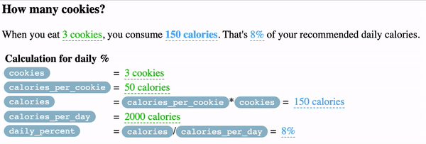

# Remark-Tangle

Remark and mdast plugins for creating interactive markdown documents.

---

Remark-Tangle extends plain text markdown with a special notation (via [remark-directive](https://github.com/remarkjs/remark-directive)) for adding controls and variables with [Tangle](http://worrydream.com/Tangle/guide.html). It's like a lightweight and inline version of [Jupyter](https://jupyter.org/), [Observable](https://observablehq.com/), [R](https://bookdown.org/yihui/rmarkdown/notebook.html), or [Wolfram](https://www.wolfram.com/notebooks/) notebooks. Or, if you like, a messier
alternative to spreadsheets.

A sample Model-Driven Markdown file looks like this:

```
When you eat :t[3 cookies]{cookies=[0..100]}, you consume **:t[150 calories]{calories}**. 
That's :t[percent]{daily_percent margin-right=0.5ch} of your recommended daily calories.

- ::t[3 cookies]{cookies}
- ::t[50 calories]{calories_per_cookie=[10..100;5]}
- ::t[150 calories]{calories=calories_per_cookie*cookies}
- ::t[2000 calories]{calories_per_day=[0..10000;100]}
- ::t[percent]{daily_percent=calories/calories_per_day}
```

And, when compiled to `html` or `mdx`, yields a page that looks like this :



## Structure

The project exports a plugin from `/dist/index.js` that you should use after the `remarkDirective` plugin.

```js
unified()
  .use(remarkParse)
  // Do stuff
  .use(remarkDirective)
  .use(tanglePlugin)
// Do more stuff

```

## Notation

Tangle fields take the format: `:t[display string]{variable configuration}`.

For example:

- `:t[3 cookies]{num_cookies=[1..10;.5]}` defines a variable, `num_cookies`, with default value `3`, display template `%d cookies` (using inferred [printf](https://alvinalexander.com/programming/printf-format-cheat-sheet/) notation), that can take values from the range `1` to `10` inclusive, with step size `0.5`.
- `:t[150. calories]{num_calories=num_cookies*num_calories_per_cookie}` defines a variable, `num_calories` that depends on the values of `num_cookies` and `num_calories_per_cookie`, with display template `%.0f calories`.
- `:t[150 calories]{num_calories}` creates a reference to a variable already defined elsewhere. These are automatically synchronized.
- Double colons `::` at the start of a tangle field create an explanation block (what you see on the bottom). This is still a work in progress.

See [the reference](/docs/reference.md) for a full account of different types of fields and their configuration.

## Timeline

There's still a lot to do.

1. Finish up explanation blocks (`::`). A list of explanation blocks should render into a single table with aligning all figured out.
2. Syncing hovers & actives. If you scroll over a field, you should see any references to and dependencies of that field light up.
3. More inputs & more data types (such as lists/distributions).
4. Replacing [Tangle](https://github.com/worrydream/Tangle), which hasn't been maintained in over a decade. It's time to move on.
5. More customizability. I'd like the option for an alternative syntax like `[3 cookies](num_cookies=[1..10])`, which has a cleaner fallback in the absence of `remark-tangle`.

## Security

This opens you up for some serious XSS vulnerabilities. Be careful, know what you are doing.

## Contribute

Still very early on, so I welcome any kind of support you might want to offer.

## Authors

- [Jesse Hoogland](https://jessehoogland.com)

The concepts and notation are inspired by a bunch of different projects:

- 🙌 **[Tangle](http://worrydream.com/Tangle/guide.html)** by [Bret Victor](http://worrydream.com/) is at the root of all of these projects.
- [Active Markdown](https://github.com/alecperkins/active-markdown) by [Alec Perkins](https://github.com/alecperkins) most inspired the syntax.
- [Dynamic Markdown](https://github.com/tal-baum/dynamic-markdown) by [Tal Lorberbaum](https://github.com/tal-baum)
- [Fangle](https://jotux.github.io/fangle/) by [@jotux](https://github.com/jotux)
- [TangleDown](https://github.com/bollwyvl/TangleDown/tree/master/tangledown) by [Nicholas Bollweg](https://github.com/bollwyvl)

## License

[MIT]() © Jesse Hoogland 
